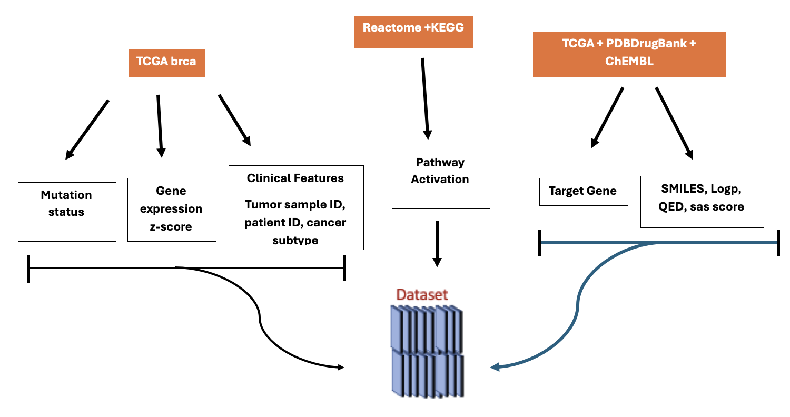
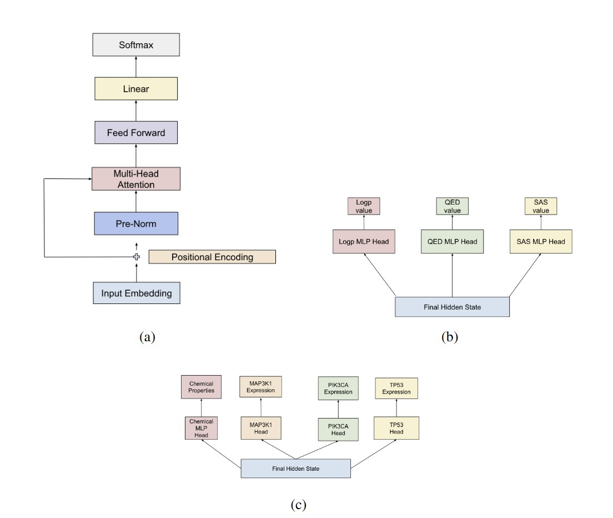

**Repository for the Molformer Model**

Current Drug Design models focus heavily on the chemical structure of drug and
target molecules, often leaving out the biological context crucial to target the highly
specific genetic and molecular landscape of cancer. To address this, we construct
a transformer model, Molformer, that can generate molecular representations
that are optimized for both chemical properties and biological data, including 
genetic mutations, gene expression, and pathway information.



We utilize classification heads during training to enable chemical and biological property prediction. 
For our baseline model, we use the Zinc-250k dataset which consists of 250,000 small drug-like
molecules and their SMILES (molecular structure) representation. This dataset
also includes the LogP, QED, and SAS values for each molecule.

To generate our multimodal biological dataset, we develop a reproducible pipeline that extracts and
processes mutation, gene expression, tumor sample, and patient data from multiple data files from the
TCGA PanCancerAtlas Breast Invasive Carcinoma study.  We focus on three key driver genes PIK3CA, TP53,
and MAP3K1. 




The repository is organized as the following:


Molformer model is located within the folder called **model**

Molformer model using chemical property data is found in **molformer.py**

Molformer model using chemical property data and biological data is found in **biomolformer.py**

Training and inference scripts are in the following files:

**train.py**

**eval.py**

**bio_train.py**

**bio_eval.py**

**pretraining_scripts.py**

**finetune_script.py**

Data processing scripts are in the folder called **data_processing**


Evaluation scripts are found in the folder called **evaluation**

Data is found in the folder called **data**


To train and run inference on ChemMolformer model using Zinc-250k dataset:

```bash
python train.py

python eval.py
```

To train and run inference on BioMolformer model using integrated dataset:

```bash
python bio_train.py

python bio_eval.py
```

